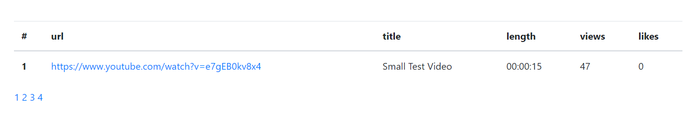
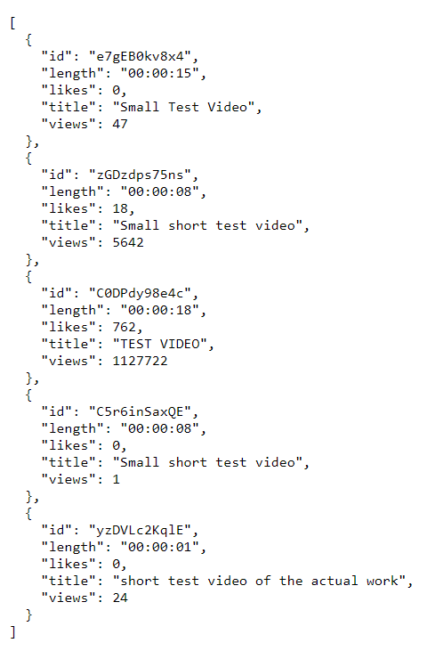

# Yt-video-api

## clone project
```sh
git clone https://github.com/soham-1/Yt-video-api.git
```

## Installation
* create a new virtual environment
```
pip install requirements.txt
```

* create a google oauth client id and create a config.py file in yt_videos_api folder
* fill in all the necessary key=value pairs
* set config.secret_key to any value

## Run using
```sh
python main.py
```

## API endpoints
> GET
* /ytVideo/<string:video_id>/<string:resolution> - returns metadata for specified video
* /listVideos/<int:page_num> - returns list of all videos by pagination
* /listVideos/filter_views/<int:page_num>/<int:views> - returns filtered view list of video having greater views than specified
* /listVideos/filter_likes/<int:page_num>/<int:likes> - returns filtered view list of video having greater likes than specified
* /ytVideo/all - json response of all videos and their metadata
* login - google oauth login screen

> PUT
*  /ytVideo/<string:video_id>/<string:resolution> - downloads video in videos folder for specified video and resolution.


